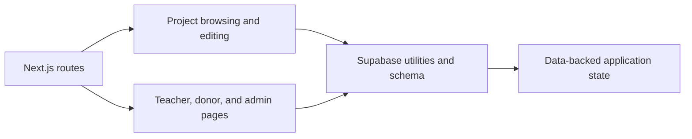

# SeedCore Data Model

A Next.js application for connecting private-school teachers with donors who fund classroom projects.

> [!IMPORTANT]
> Keep Supabase credentials in local environment configuration and verify the database schema before relying on data-backed workflows.


[](package.json)

<p align="center">
  
</p>

## Overview

The application presents educational funding projects, supports authentication, and includes teacher, donor, and administrative workflows. The committed UI includes project browsing, project creation and editing, account pages, teacher pages, admin pages, and Supabase utilities.

## Media

No application preview is included. The repository's classroom image assets are not a verified rendered application state, and the Next.js runtime was not available for a trustworthy local capture.

## Features and structure

- `src/app/projects/` — project listing, detail, and creation routes
- `src/app/teacher/` — teacher project workflows
- `src/app/admin/` — administrative project and dashboard routes
- `src/app/account/` — account and wishlist routes
- `src/components/` — navigation, authentication, project, and status components
- `public/` — classroom imagery, logos, and placeholder assets

## Getting started

Install dependencies and start the development server from the repository root:

```bash
npm install
npm run dev
```

Open `http://localhost:3000`. Supabase configuration is required for data-backed features; keep credentials in local environment configuration and do not commit them.

The package also defines `npm run build` and `npm run start`. The configured `npm run lint` script is present in `package.json`, though its compatibility depends on the installed Next.js tooling.

## Status and limitations

The repository contains an active application codebase and committed classroom imagery, but no verified public demo is documented here. Database-backed behavior depends on external Supabase configuration and schema.

## License and attribution

No root `LICENSE` file is present in this checkout. Preserve the project's existing faith-based education context and any third-party asset attribution.

## Application flow


