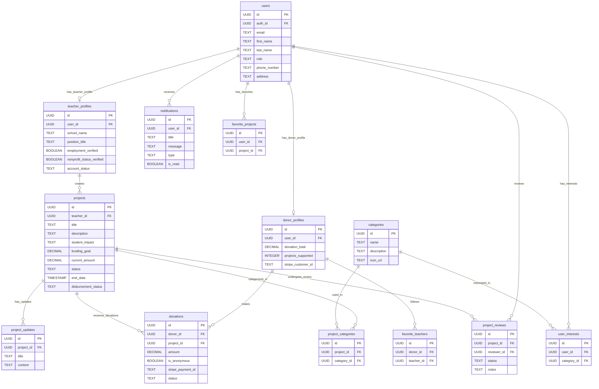

# Beyond Measure Data Model (Simplified)

## Overview
This document outlines the simplified data model for the Beyond Measure platform, focusing only on essential tables.

## Database Tables

### 1. Users

```sql
CREATE TABLE users (
    id UUID PRIMARY KEY DEFAULT uuid_generate_v4(),
    auth_id UUID UNIQUE REFERENCES auth.users(id),
    email TEXT UNIQUE NOT NULL,
    first_name TEXT NOT NULL,
    last_name TEXT NOT NULL,
    profile_image_url TEXT,
    role TEXT NOT NULL CHECK (role IN ('teacher', 'donor', 'admin')),
    phone_number TEXT,
    address TEXT,
    city TEXT,
    state TEXT,
    postal_code TEXT,
    country TEXT DEFAULT 'USA',
    created_at TIMESTAMPTZ NOT NULL DEFAULT NOW(),
    updated_at TIMESTAMPTZ NOT NULL DEFAULT NOW(),
    last_login_at TIMESTAMPTZ
);
```

### 2. Teacher Profiles

```sql
CREATE TABLE teacher_profiles (
    id UUID PRIMARY KEY DEFAULT uuid_generate_v4(),
    user_id UUID UNIQUE NOT NULL REFERENCES users(id) ON DELETE CASCADE,
    school_name TEXT NOT NULL,
    school_district TEXT,
    school_address TEXT NOT NULL,
    school_city TEXT NOT NULL,
    school_state TEXT NOT NULL,
    school_postal_code TEXT NOT NULL,
    position_title TEXT NOT NULL,
    employment_verified BOOLEAN DEFAULT FALSE,
    nonprofit_status_verified BOOLEAN DEFAULT FALSE,
    guidestar_charity_id TEXT,
    account_status TEXT NOT NULL DEFAULT 'pending' CHECK (account_status IN ('pending', 'approved', 'denied', 'inactive')),
    instagram_username TEXT,
    created_at TIMESTAMPTZ NOT NULL DEFAULT NOW(),
    updated_at TIMESTAMPTZ NOT NULL DEFAULT NOW()
);
```

### 3. Donor Profiles

```sql
CREATE TABLE donor_profiles (
    id UUID PRIMARY KEY DEFAULT uuid_generate_v4(),
    user_id UUID UNIQUE NOT NULL REFERENCES users(id) ON DELETE CASCADE,
    donation_total DECIMAL(12,2) DEFAULT 0.00,
    projects_supported INTEGER DEFAULT 0,
    is_anonymous_by_default BOOLEAN DEFAULT FALSE,
    receives_updates_email BOOLEAN DEFAULT TRUE,
    stripe_customer_id TEXT,
    instagram_username TEXT,
    created_at TIMESTAMPTZ NOT NULL DEFAULT NOW(),
    updated_at TIMESTAMPTZ NOT NULL DEFAULT NOW()
);
```

### 4. Categories/Interests

```sql
CREATE TABLE categories (
    id UUID PRIMARY KEY DEFAULT uuid_generate_v4(),
    name TEXT UNIQUE NOT NULL,
    description TEXT,
    icon_url TEXT,
    display_order INTEGER,
    is_active BOOLEAN DEFAULT TRUE,
    created_at TIMESTAMPTZ NOT NULL DEFAULT NOW(),
    updated_at TIMESTAMPTZ NOT NULL DEFAULT NOW()
);
```

### 5. User Interests

```sql
CREATE TABLE user_interests (
    id UUID PRIMARY KEY DEFAULT uuid_generate_v4(),
    user_id UUID NOT NULL REFERENCES users(id) ON DELETE CASCADE,
    category_id UUID NOT NULL REFERENCES categories(id) ON DELETE CASCADE,
    created_at TIMESTAMPTZ NOT NULL DEFAULT NOW(),
    UNIQUE(user_id, category_id)
);
```

### 6. Projects

```sql
CREATE TABLE projects (
    id UUID PRIMARY KEY DEFAULT uuid_generate_v4(),
    teacher_id UUID NOT NULL REFERENCES teacher_profiles(id) ON DELETE CASCADE,
    title TEXT NOT NULL,
    description TEXT NOT NULL,
    student_impact TEXT NOT NULL,
    funding_goal DECIMAL(12,2) NOT NULL,
    current_amount DECIMAL(12,2) DEFAULT 0.00,
    start_date TIMESTAMPTZ,
    end_date TIMESTAMPTZ,
    main_image_url TEXT,
    status TEXT NOT NULL DEFAULT 'draft' CHECK (status IN ('draft', 'pending_review', 'active', 'funded', 'completed', 'expired', 'denied')),
    featured BOOLEAN DEFAULT FALSE,
    donor_count INTEGER DEFAULT 0,
    is_extended BOOLEAN DEFAULT FALSE,
    disbursement_status TEXT DEFAULT NULL CHECK (disbursement_status IN (NULL, 'pending', 'processed', 'failed')),
    disbursement_date TIMESTAMPTZ,
    created_at TIMESTAMPTZ NOT NULL DEFAULT NOW(),
    updated_at TIMESTAMPTZ NOT NULL DEFAULT NOW(),
    published_at TIMESTAMPTZ,
    completed_at TIMESTAMPTZ
);
```

### 7. Project Categories

```sql
CREATE TABLE project_categories (
    id UUID PRIMARY KEY DEFAULT uuid_generate_v4(),
    project_id UUID NOT NULL REFERENCES projects(id) ON DELETE CASCADE,
    category_id UUID NOT NULL REFERENCES categories(id) ON DELETE CASCADE,
    created_at TIMESTAMPTZ NOT NULL DEFAULT NOW(),
    UNIQUE(project_id, category_id)
);
```

### 8. Project Updates

```sql
CREATE TABLE project_updates (
    id UUID PRIMARY KEY DEFAULT uuid_generate_v4(),
    project_id UUID NOT NULL REFERENCES projects(id) ON DELETE CASCADE,
    title TEXT NOT NULL,
    content TEXT NOT NULL,
    image_url TEXT,
    created_at TIMESTAMPTZ NOT NULL DEFAULT NOW(),
    updated_at TIMESTAMPTZ NOT NULL DEFAULT NOW()
);
```

### 9. Donations

```sql
CREATE TABLE donations (
    id UUID PRIMARY KEY DEFAULT uuid_generate_v4(),
    donor_id UUID NOT NULL REFERENCES donor_profiles(id) ON DELETE CASCADE,
    project_id UUID NOT NULL REFERENCES projects(id) ON DELETE CASCADE,
    amount DECIMAL(12,2) NOT NULL,
    is_anonymous BOOLEAN DEFAULT FALSE,
    message TEXT,
    stripe_payment_id TEXT,
    status TEXT NOT NULL DEFAULT 'pending' CHECK (status IN ('pending', 'completed', 'failed', 'refunded')),
    shared_on_instagram BOOLEAN DEFAULT FALSE,
    created_at TIMESTAMPTZ NOT NULL DEFAULT NOW(),
    updated_at TIMESTAMPTZ NOT NULL DEFAULT NOW()
);
```

### 10. Favorite Projects

```sql
CREATE TABLE favorite_projects (
    id UUID PRIMARY KEY DEFAULT uuid_generate_v4(),
    user_id UUID NOT NULL REFERENCES users(id) ON DELETE CASCADE,
    project_id UUID NOT NULL REFERENCES projects(id) ON DELETE CASCADE,
    created_at TIMESTAMPTZ NOT NULL DEFAULT NOW(),
    UNIQUE(user_id, project_id)
);
```

### 11. Favorite Teachers

```sql
CREATE TABLE favorite_teachers (
    id UUID PRIMARY KEY DEFAULT uuid_generate_v4(),
    donor_id UUID NOT NULL REFERENCES donor_profiles(id) ON DELETE CASCADE,
    teacher_id UUID NOT NULL REFERENCES teacher_profiles(id) ON DELETE CASCADE,
    created_at TIMESTAMPTZ NOT NULL DEFAULT NOW(),
    UNIQUE(donor_id, teacher_id)
);
```

### 12. Notifications

```sql
CREATE TABLE notifications (
    id UUID PRIMARY KEY DEFAULT uuid_generate_v4(),
    user_id UUID NOT NULL REFERENCES users(id) ON DELETE CASCADE,
    title TEXT NOT NULL,
    message TEXT NOT NULL,
    type TEXT NOT NULL,
    is_read BOOLEAN DEFAULT FALSE,
    related_entity_id UUID,
    related_entity_type TEXT,
    created_at TIMESTAMPTZ NOT NULL DEFAULT NOW(),
    updated_at TIMESTAMPTZ NOT NULL DEFAULT NOW()
);
```

### 13. Project Reviews

```sql
CREATE TABLE project_reviews (
    id UUID PRIMARY KEY DEFAULT uuid_generate_v4(),
    project_id UUID NOT NULL REFERENCES projects(id) ON DELETE CASCADE,
    reviewer_id UUID NOT NULL REFERENCES users(id) ON DELETE CASCADE,
    status TEXT NOT NULL CHECK (status IN ('approved', 'denied', 'needs_revision')),
    notes TEXT,
    created_at TIMESTAMPTZ NOT NULL DEFAULT NOW(),
    updated_at TIMESTAMPTZ NOT NULL DEFAULT NOW()
);
```

## ER Diagram

Below is the simplified entity-relationship diagram:

